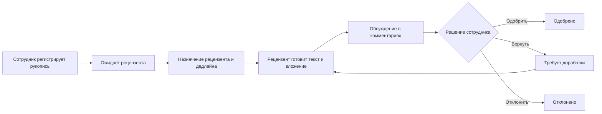
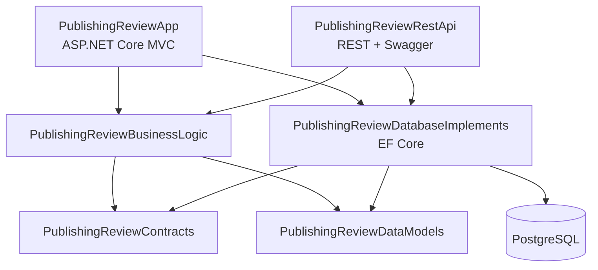

# PublishingReview

> Курсовой проект: веб-модуль для управления публикациями и полным циклом издательского рецензирования.


PublishingReview автоматизирует работу с рукописями: регистрацию публикации, назначение рецензента и дедлайна, подготовку рецензии с вложением, обсуждение в комментариях, фиксацию итогового решения и формирование отчётности.

Решение состоит из ASP.NET Core MVC-приложения, отдельного REST API и нескольких библиотек, разделяющих контракты, бизнес-логику, модели предметной области и доступ к PostgreSQL.

## Содержание

- [О проекте](#о-проекте)
- [Роли и возможности](#роли-и-возможности)
- [Процесс рецензирования](#процесс-рецензирования)
- [Основные функции](#основные-функции)
- [Архитектура](#архитектура)
- [Модель данных](#модель-данных)
- [REST API](#rest-api)
- [Дополнительный модуль интернет-магазина](#дополнительный-модуль-интернет-магазина)
- [Технологии](#технологии)
- [Запуск](#запуск)
- [Структура репозитория](#структура-репозитория)
- [Ограничения учебной версии](#ограничения-учебной-версии)

## О проекте

Тема проекта — **«Проектирование и разработка модуля рецензирования для издательства»**.

Система переводит издательский процесс из набора несвязанных операций в единый workflow. Сотрудник регистрирует рукопись, назначает рецензента и срок выполнения, пользователь подготавливает рецензию, а результат возвращается сотруднику для принятия решения.

Для контроля процесса предусмотрены очередь задач, оперативная панель со статистикой и отчёт за выбранный период. Каталог публикаций объединяет сведения об изданиях, рецензиях, авторах и текущем результате проверки.

## Роли и возможности

В MVC-приложении реализованы два пользовательских сценария.

| Возможность | Пользователь / рецензент | Сотрудник издательства |
| --- | :---: | :---: |
| Просмотр каталога публикаций | ✓ | ✓ |
| Добавление публикаций в избранное | ✓ | — |
| Создание и редактирование собственных рецензий | ✓ | — |
| Прикрепление файла к рецензии | ✓ | — |
| Просмотр и добавление комментариев | ✓ | ✓ |
| Создание и изменение публикаций | — | ✓ |
| Назначение рецензента и дедлайна | — | ✓ |
| Принятие решения по рецензии | — | ✓ |
| Просмотр очереди и статистики | — | ✓ |
| Выгрузка отчёта | — | ✓ |

Состояние входа, email, имя и роль сохраняются в серверной сессии. Контроллер проверяет аутентификацию и роль перед открытием закрытых страниц и выполнением соответствующих MVC-операций.

## Процесс рецензирования



В интерфейсе используются пять состояний процесса:

- ожидает назначения рецензента;
- находится на рецензировании;
- требует доработки;
- одобрено;
- отклонено.

Если пользователь изменяет текст уже рассмотренной рецензии, она снова переводится в состояние ожидания проверки.

## Основные функции

### Работа с публикациями

- регистрация рукописи с названием, автором, типом и комментарием редактора;
- полный CRUD публикаций для сотрудника;
- каталог с поиском по названию и фильтрацией по типу издания;
- связь публикаций с несколькими авторами;
- добавление и удаление публикации из избранного;
- просмотр всех рецензий и комментариев к выбранной публикации.

### Работа с рецензиями

- персональный список рецензий пользователя;
- создание, изменение и удаление только собственных записей;
- загрузка файла и сохранение метаданных вложения;
- назначение рецензента по email;
- установка срока выполнения;
- фиксация решения: одобрить, отправить на доработку или отклонить;
- обсуждение рецензии через комментарии;
- чтение приложенного текстового файла с поддержкой UTF-8 и Windows-1251.

### Мониторинг и отчётность

Оперативная панель показывает количество публикаций и распределение задач по состояниям. Очередь можно фильтровать по статусу и сортировать по дедлайну.

Отчёт строится за выбранный период и содержит публикацию, автора, тип, статус, рецензента, дедлайн и дату создания задачи. Доступны:

- JSON-представление со сводными показателями;
- CSV-файл в UTF-8 с BOM для корректного открытия в табличных редакторах.

В слое бизнес-логики также находится инфраструктура генерации PDF через PDFsharp/MigraDoc, подготовленная для расширения отчётности.

## Архитектура



| Проект | Назначение |
| --- | --- |
| `PublishingReviewApp` | MVC-интерфейс, Razor Views, сессии и пользовательские сценарии |
| `PublishingReviewRestApi` | Отдельный HTTP API и Swagger UI |
| `PublishingReviewBusinessLogic` | Валидация и операции над пользователями, публикациями, рецензиями, комментариями и вложениями |
| `PublishingReviewContracts` | Binding-, Search- и View-модели, интерфейсы сервисов и хранилищ |
| `PublishingReviewDataModels` | Общие интерфейсы предметных моделей и перечисления |
| `PublishingReviewDatabaseImplements` | EF Core-контекст, сущности, хранилища и миграции PostgreSQL |

Зависимости регистрируются через встроенный DI-контейнер ASP.NET Core. Бизнес-логика работает с абстракциями хранилищ, а реализация доступа к данным вынесена в отдельный проект.

## Модель данных

Основные сущности:

| Сущность | Назначение |
| --- | --- |
| `User` | Пользователь системы, роль и данные для входа |
| `Employee` | Сотрудник издательства |
| `Publication` | Рукопись или опубликованный материал |
| `PublicationAuthor` | Связь many-to-many между публикациями и авторами |
| `PublicationFavorite` | Составной ключ для избранного пользователя |
| `Review` | Текст рецензии, статус, дедлайн и результат подтверждения |
| `Comment` | Обсуждение конкретной рецензии |
| `Attachment` | Метаданные приложенного к рецензии файла |

В EF Core настроены составные ключи, каскадное удаление зависимых данных, ограничение удаления автора комментария и сохранение сотрудника, подтвердившего рецензию.

## REST API

В режиме `Development` документация доступна через Swagger UI.

| Ресурс | Операции |
| --- | --- |
| `/api/Users` | Получение списка и элемента, создание, изменение, удаление |
| `/api/Publications` | CRUD публикаций, добавление и удаление авторов |
| `/api/Reviews` | CRUD рецензий |
| `/api/Comments` | Комментарии по рецензии, создание и удаление |
| `/api/Attachments` | Вложения по рецензии, создание и удаление |
| `/api/Favorites` | Добавление, удаление и список избранного пользователя |

Примеры маршрутов:

```http
GET    /api/Publications
GET    /api/Publications/5
POST   /api/Publications
POST   /api/Publications/AddAuthors
GET    /api/Comments/ByReview/12
POST   /api/Favorites/Add?userId=3&publicationId=5
```

## Дополнительный модуль интернет-магазина

После завершения основной курсовой работы репозиторий был расширен экзаменационной адаптацией предметной области «Интернет-магазин». Этот модуль сосуществует с системой издательского рецензирования и включает:

- товары и категории со связью many-to-many;
- CRUD товаров;
- отзывы на товары с редактированием и удалением автором;
- пользовательские оценки товаров;
- поиск и фильтры по категории, цене и рейтингу;
- отдельные `ProductsController`, `ReviewsController`, DTO, сервисы и Razor Views.

Основные маршруты дополнительного модуля:

```text
/Products/Index
/Products/Details/{id}
/Products/Create
/Products/Edit/{id}
/Products/Delete/{id}
/Reviews/Index
/Reviews/Create
/Reviews/Edit/{id}
/Reviews/Delete/{id}
```

Таким образом, текущий репозиторий демонстрирует как исходную курсовую архитектуру, так и её последующую адаптацию под другую предметную область.

## Технологии

- C# и .NET 8;
- ASP.NET Core MVC и Razor Views;
- ASP.NET Core Web API;
- Entity Framework Core 9;
- PostgreSQL 15 и Npgsql;
- Swagger / OpenAPI;
- Dependency Injection;
- серверные сессии ASP.NET Core;
- `PasswordHasher<TUser>`;
- PDFsharp / MigraDoc;
- Bootstrap, JavaScript и CSS;
- log4net и стандартное логирование ASP.NET Core.

## Запуск

### Требования

- [.NET 8 SDK](https://dotnet.microsoft.com/download/dotnet/8.0);
- PostgreSQL 15 или совместимая версия;
- Git;
- необязательно: Visual Studio 2022.

### 1. Клонирование и сборка

```bash
git clone https://github.com/okutagawa/CourseWork_PublishingReview.git
cd CourseWork_PublishingReview
dotnet restore
dotnet build PublishingReview.sln
```

### 2. Настройка PostgreSQL

Создайте базу данных `PublishingReview` и передайте строку подключения через переменную окружения. Не храните рабочие пароли в репозитории.

PowerShell:

```powershell
$env:PUBLISHING_DB_CONNECTION = "Host=localhost;Port=5432;Database=PublishingReview;Username=<USER>;Password=<PASSWORD>"
```

Bash:

```bash
export PUBLISHING_DB_CONNECTION='Host=localhost;Port=5432;Database=PublishingReview;Username=<USER>;Password=<PASSWORD>'
```

### 3. Запуск REST API

```bash
dotnet run --project PublishingReviewRestApi --launch-profile https
```

При старте API применяет миграции EF Core. Адреса профиля разработки:

- API: `https://localhost:7039`;
- Swagger UI: `https://localhost:7039/swagger`.

### 4. Запуск MVC-приложения

Во втором терминале с той же переменной окружения:

```bash
dotnet run --project PublishingReviewApp --launch-profile https
```

Интерфейс откроется по адресу `https://localhost:7231/Home/Index`.

Если локальный HTTPS-сертификат ещё не настроен:

```bash
dotnet dev-certs https --trust
```

Для проверки полного workflow зарегистрируйте две учётные записи: пользователя и сотрудника. Пароль должен содержать не менее восьми символов, заглавную и строчную буквы, цифру и специальный символ.

## Структура репозитория

```text
CourseWork_PublishingReview/
├── PublishingReviewApp/                 # MVC-приложение и Razor Views
│   ├── Controllers/
│   ├── Models/
│   ├── Services/                        # Дополнительный shop-модуль
│   ├── Views/
│   └── wwwroot/
├── PublishingReviewRestApi/             # REST API и Swagger
│   ├── Controllers/
│   └── Models/Dto/
├── PublishingReviewBusinessLogic/       # Бизнес-правила и PDF-инфраструктура
├── PublishingReviewContracts/           # Контракты между слоями
├── PublishingReviewDataModels/          # Интерфейсы моделей и enum
├── PublishingReviewDatabaseImplements/  # EF Core, PostgreSQL и миграции
├── PublishingReview.sln
└── README.md
```

## Что демонстрирует проект

- проектирование многослойного ASP.NET Core-решения;
- выделение контрактов, бизнес-логики и инфраструктуры хранения;
- моделирование связей one-to-many и many-to-many в EF Core;
- реализацию MVC-интерфейса и отдельного REST API;
- построение ролевых пользовательских сценариев;
- работу с файлами, комментариями, статусами и дедлайнами;
- фильтрацию, отчётность и экспорт в CSV;
- адаптацию существующей архитектуры под дополнительную предметную область.

## Ограничения учебной версии

Проект является учебным прототипом. Перед production-развёртыванием необходимо:

- заменить сессионную проверку ролей полноценной ASP.NET Core Identity или внешним Identity Provider;
- запретить самостоятельный выбор роли сотрудника при регистрации;
- добавить обязательную проверку пароля при входе;
- защитить REST API аутентификацией и политиками авторизации;
- удалить строки подключения и пароли из исходного кода и истории Git, сменить опубликованные учётные данные;
- ограничить тип, размер и место хранения загружаемых файлов;
- добавить автоматизированные тесты и CI-проверки;
- синхронизировать конфигурацию URL MVC-клиента и API;
- удалить из репозитория сгенерированные каталоги `obj` и пользовательские загрузки;
- добавить лицензию и инструкцию по production-развёртыванию.

---

**PublishingReview** — курсовой проект, демонстрирующий разработку прикладной информационной системы от модели данных и бизнес-правил до веб-интерфейса, REST API и отчётности.
